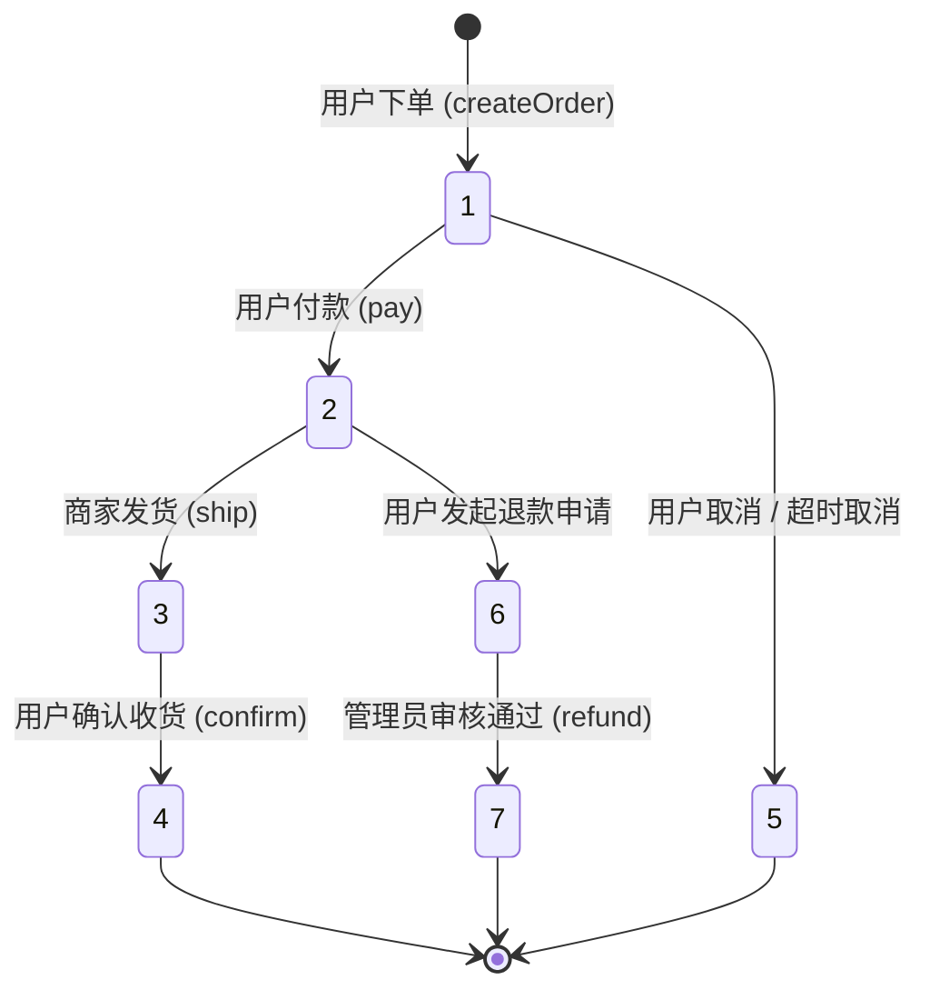
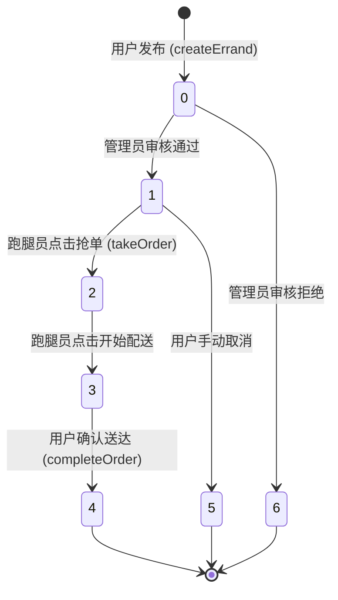

# 校园跑腿与交易系统 - 订单与物流状态流转分析

本文件详细分析了系统中**商品订单**与**跑腿订单**的状态变更逻辑，重点标注了触发状态转化的关键业务节点及其对物流/资金的影响。

---

## 1. 商品订单状态流转 (Product Order Flow)

商品订单主要涉及“用户-商家”之间的实物交易逻辑。

### 1.1 状态编码定义
| 状态码 | 业务含义 | 物流阶段说明 |
| :--- | :--- | :--- |
| **1** | 待支付 | 订单已生成，库存已锁定，等待用户付款 |
| **2** | 待发货 | 用户已付款，等待商家打包并点击发货 |
| **3** | 待收货 | 商家已发货，物流配送中，等待用户确认 |
| **4** | 已完成 | 用户确认收货，资金结算给商家，交易闭环 |
| **5** | 已取消 | 用户或管理员手动取消，库存释放 |
| **6** | 退款中 | 用户发起售后申请，等待管理员/商家审核 |
| **7** | 已退款 | 退款原路返回用户钱包，交易终止 |

### 1.2 关键节点逻辑


---

## 2. 跑腿订单状态流转 (Errand Order Flow)

跑腿订单涉及“用户-跑腿员”之间的劳务交易逻辑，具有更严格的审核与并发控制。

### 2.1 状态编码定义
| 状态码 | 业务含义 | 逻辑节点说明 |
| :--- | :--- | :--- |
| **0** | 待审核 | 任务发布成功，等待管理员合规性审核 |
| **1** | 待接单 | 审核通过，任务进入大厅公开可见 |
| **2** | 已接单 | 跑腿员抢单成功，任务锁定 |
| **3** | 配送中 | 跑腿员取货完成，正在前往目的地 |
| **4** | 已完成 | 用户确认送达，赏金结算至跑腿员钱包 |
| **5** | 已取消 | 发布者取消或任务超时未领 |
| **6** | 审核拒绝 | 管理员判定内容违规，任务终止 |

### 2.2 关键节点逻辑


---

## 3. 核心代码逻辑分析

### 3.1 并发抢单安全 (Atomic Update)
在 [ErrandServiceImpl.java](file:///Users/develop/final_college/demo/src/main/java/com/example/demo/service/impl/ErrandServiceImpl.java) 中，为了确保一个跑腿任务不会被两个跑腿员同时接到，使用了 SQL 层面的条件更新：
```java
// SQL: update errand_orders set status=2 where order_no=? and status=1
int updated = errandOrderMapper.updateStatus(orderNo, 2, runnerId);
if (updated == 0) throw new IllegalStateException("接单失败");
```
**分析**：该操作利用了数据库的行锁，只有在状态确实为 `1`（待接单）时才会更新成功，从而在物理层面规避了并发冲突。

### 3.2 资金结算与状态同步 (Transaction Consistency)
在商品订单的 `confirm` [OrderServiceImpl.java](file:///Users/develop/final_college/demo/src/main/java/com/example/demo/service/impl/OrderServiceImpl.java) 和跑腿订单的 `completeOrder` 中，状态变更为 `4` 的同时，会伴随资金划转：
1.  **状态变更**：`update order_status = 4`。
2.  **资金结算**：调用 `walletService.addIncome`。
3.  **事务保证**：使用 `@Transactional` 确保如果资金增加失败（如账户异常），订单状态会自动回滚，防止数据不一致。

### 3.3 审核机制节点
管理员通过 [AdminErrandController.java](file:///Users/develop/final_college/demo/src/main/java/com/example/demo/controller/AdminErrandController.java) 进行状态干预：
- 任务从 `0` 到 `1` 的跃迁是校园安全的第一道防线。
- 管理员拥有强制将任何非完成状态订单置为 `5`（已取消）的权限，用于处理异常争议。
