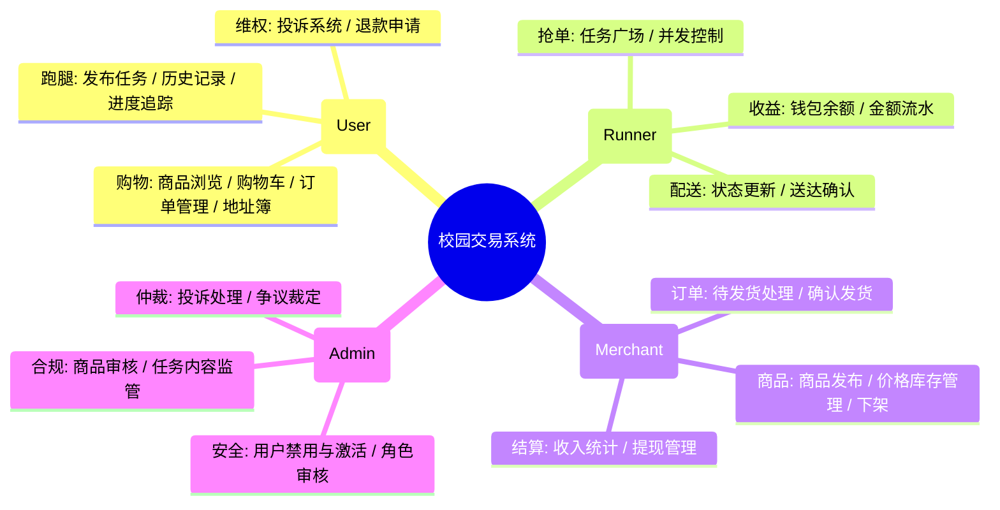
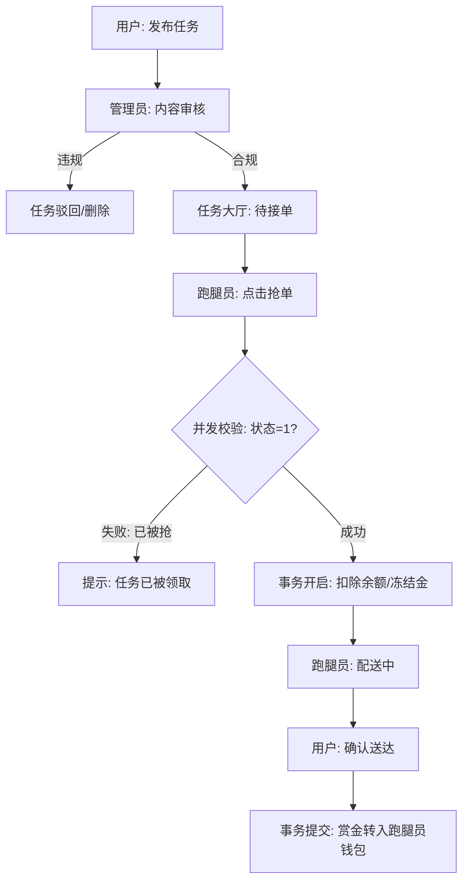
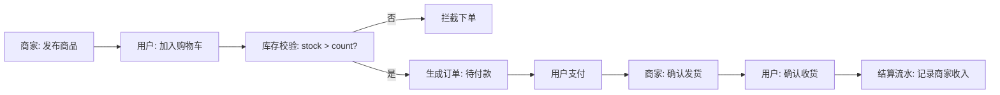
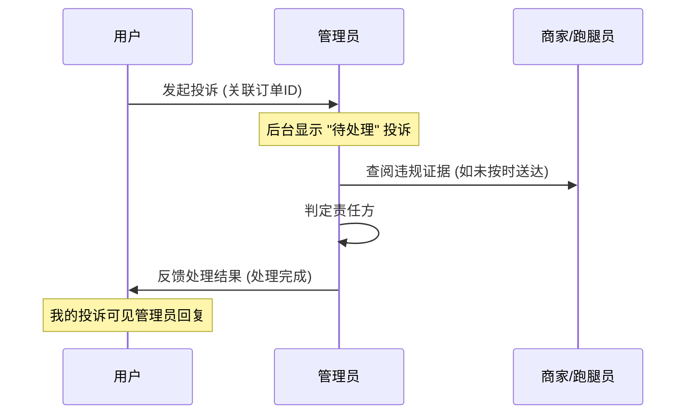

# 校园跑腿与交易系统 - 项目深度分析与流程文档

本文件旨在深入剖析系统的业务架构、角色分工及其核心业务流向，为毕业论文的“系统设计”与“流程分析”章节提供素材。

---

## 1. 系统核心思路图 (Mind Map)

系统的设计理念是围绕“校园内微循环交易”展开，通过权限分层实现安全管控。



---

## 2. 核心角色任务流程图 (Flow Charts)

### 2.1 校园跑腿业务流程 (Errand Lifecycle)
跑腿业务涉及用户发布与跑腿员抢单，采用了并发锁控制与事务回滚机制。



### 2.2 商家商品交易流程 (Product Transaction)
涵盖了从商品发布到最终确认收货的闭环。



### 2.3 投诉与仲裁处理流程 (Complaint Arbitration)
系统特有的维权流程，由管理员介入解决买卖双方争议。



---

## 3. 核心功能模块设计

### 3.1 身份认证与权限分流 (RBAC)
系统采用 `userType` 字段（0:Admin, 1:User, 2:Runner, 3:Merchant）进行权限隔离。
- **前端实现**：[App.vue](file:///Users/develop/final_college/demo/frontend/src/App.vue) 根据 `localStorage` 中的 `userType` 动态渲染底栏 Dock 菜单。
- **后端实现**：[JwtInterceptor.java](file:///Users/develop/final_college/demo/src/main/java/com/example/demo/interceptor/JwtInterceptor.java) 拦截 `/admin/**` 路径，强制校验管理员身份。

### 3.2 高并发接单安全性
为了防止多人抢同一单，在 [ErrandServiceImpl.java](file:///Users/develop/final_college/demo/src/main/java/com/example/demo/service/impl/ErrandServiceImpl.java) 中使用了 SQL 层面的条件更新：
```sql
update errand_order set status=2, runner_id=#{id} 
where order_no=#{no} and status=1 and runner_id is null;
```
若更新行数为 0，则说明任务已被抢走，抛出异常触发事务回滚。

### 3.3 购物流水与记录管理
商家和跑腿员在“我的”页面均有专门的“金额流水”模块。
- **商家端**：关注商品销售毛利。
- **跑腿员**：关注每单配送赏金的到账情况。
- **管理端**：可调取所有异常流水的原始记录。

---

## 4. 论文思路引导
在撰写论文时，您可以按照以下逻辑引用本 MD 文档：
1.  **系统分析**：引用“系统核心思路图”说明软件架构的完整性。
2.  **详细设计**：引用“核心角色任务流程图”说明业务逻辑的严密性。
3.  **技术实现**：引用“高并发接单安全性”和“RBAC 权限分流”作为技术亮点进行深入描述。
