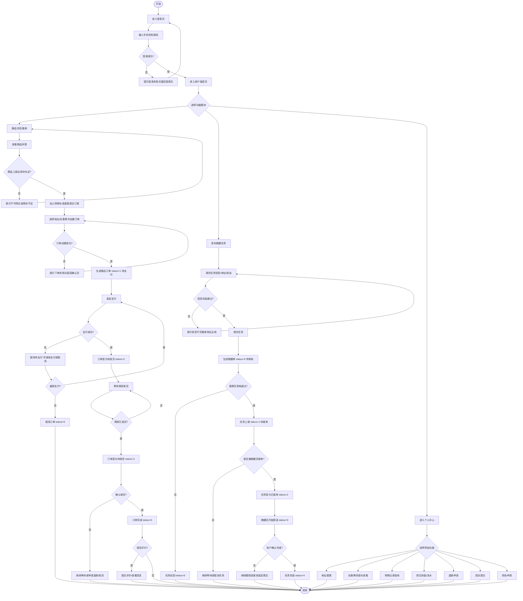
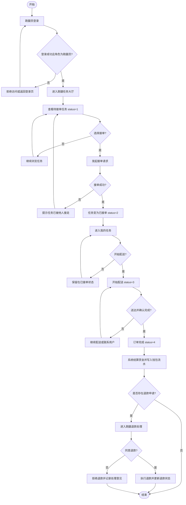
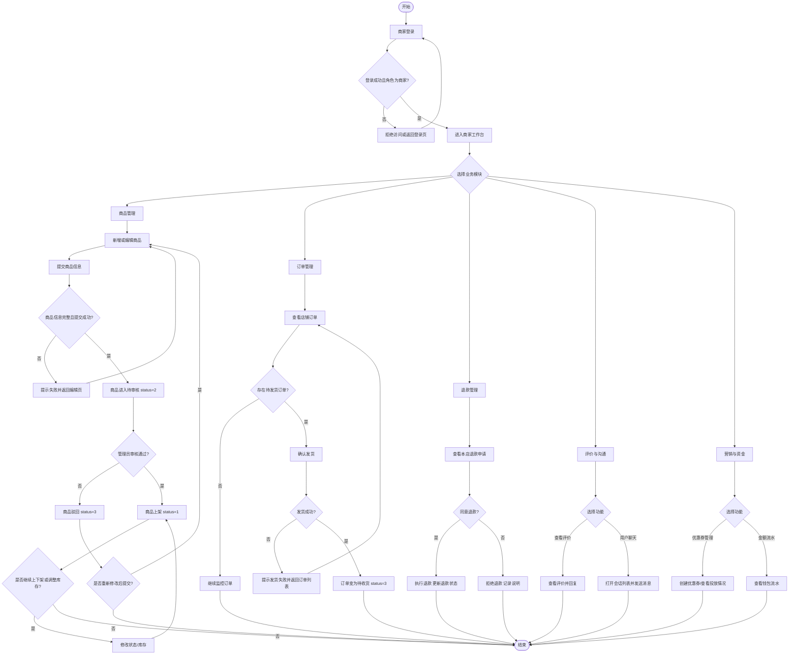
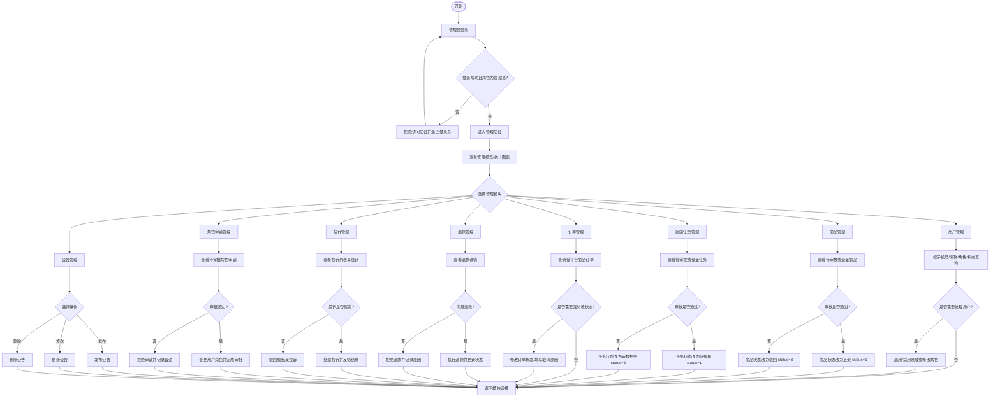

# 校园跑腿与交易系统功能重整文档

## 1. 项目定位

本项目是一个面向校园场景的综合服务系统，核心业务由两条主线组成：

1. 商品交易线：商品浏览、购物车、下单、支付、发货、收货、评价、退款。
2. 跑腿服务线：任务发布、管理员审核、骑手接单、配送、完成、退款、投诉。

系统同时具备四类角色：

- 管理员：`userType = 0`
- 普通用户：`userType = 1`
- 跑腿员：`userType = 2`
- 商家：`userType = 3`

## 2. 技术栈与目录结构

### 2.1 技术栈

- 后端：Spring Boot
- 持久层：MyBatis
- 鉴权方式：JWT + 拦截器 + BaseContext
- 前端：Vue 3 + Vue Router + Element Plus
- 图表：ECharts
- 即时通信：WebSocket
- 地图能力：高德地图/Amap（跑腿地址估价与地理编码）

### 2.2 目录结构

- 后端控制器：`src/main/java/com/example/demo/controller`
- 前端页面：`frontend/src/views`
- 前端路由：`frontend/src/router/index.js`
- 接口文档：`openapi.json`、`api-docs.json`
- 数据脚本：`final_collage.sql`、`mock_data.sql`

## 3. 系统整体功能重整

### 3.1 公共基础能力

#### 认证与权限

- 登录、注册、邮箱验证码发送
- 用户信息查询与资料更新
- JWT 登录态维护
- 基于 `userType` 的路由分流与页面访问限制
- 管理员路由单独保护

#### 公共信息能力

- 公告查看
- 管理员发布、修改、删除公告
- 图片/文件上传

#### 账户与资金

- 钱包余额展示
- 钱包充值
- 钱包流水查询

#### 申诉与售后共用能力

- 退款申请与处理
- 投诉提交与处理
- 角色申请与审批

### 3.2 商品交易相关功能

#### 商品与分类

- 商品分类查询
- 商家创建分类、修改分类、启停分类
- 商品列表搜索
- 商品详情查看
- 商家发布商品
- 商家编辑商品
- 商家上下架商品
- 商家调整库存
- 管理员审核商品

#### 购物与下单

- 加入购物车
- 修改购物车数量
- 删除购物车商品
- 清空购物车
- 创建订单
- 支付订单
- 取消订单
- 商家发货
- 用户确认收货
- 查看订单详情
- 用户查看我的订单
- 商家查看店铺订单
- 管理员查看全平台商品订单
- 管理员强制修改商品订单状态

#### 评价与互动

- 用户对已完成订单评价
- 查看商品评价
- 对评价进行回复
- 商家查看评价列表

#### 营销能力

- 商家创建优惠券
- 用户查看可领取优惠券
- 用户领取优惠券
- 用户查看我的优惠券

#### 交易留痕

- 查看购物记录
- 按时间/订单号筛选购物记录
- 删除单条购物记录
- 批量删除购物记录

### 3.3 跑腿服务相关功能

- 用户发布跑腿任务
- 用户查看我的跑腿订单
- 跑腿员查看待接单任务大厅
- 跑腿员接单
- 跑腿员开始配送
- 跑腿员/用户确认完成
- 跑腿员查看我的任务
- 管理员审核跑腿任务
- 管理员强制修改跑腿任务状态
- 跑腿场景退款处理
- 跑腿场景投诉处理
- 跑腿赏金进入钱包流水

### 3.4 客服与沟通相关功能

- 商家与用户聊天
- 会话列表查询
- 历史消息查询
- 消息发送
- 消息已读处理
- WebSocket 实时消息推送

### 3.5 后端已存在但当前前端未见明显入口的能力

- 二手求购信息发布、状态变更、列表查询：`/api/wanted/**`

说明：该模块后端控制器已存在，但当前前端路由中未看到明确页面入口，可视为预留能力或未完全接入模块。

## 4. 四个角色的模块边界

### 4.1 普通用户模块

普通用户是系统中的“消费方”和“任务发起方”，主要负责：

- 商品浏览与搜索
- 商品下单与支付
- 地址管理
- 优惠券领取与使用
- 查看购物记录
- 发布跑腿任务
- 查看跑腿进度
- 发起退款
- 发起投诉
- 钱包充值
- 申请转为商家或跑腿员

### 4.2 跑腿员模块

跑腿员是系统中的“跑腿任务执行方”，主要负责：

- 查看待接单任务
- 抢单/接单
- 开始配送
- 确认送达
- 查看历史任务
- 处理与本人任务相关的退款申请
- 查看赏金流水

### 4.3 商家模块

商家是系统中的“商品提供方”，主要负责：

- 管理商品和库存
- 发布新商品并等待审核
- 上下架商品
- 查看并处理订单
- 确认发货
- 查看评价并回复
- 创建优惠券
- 处理退款申请
- 与用户聊天沟通
- 查看资金流水

### 4.4 管理员模块

管理员是系统中的“平台治理方”，主要负责：

- 后台概览与统计图表
- 公告管理
- 用户管理
- 商品审核与强制状态修改
- 跑腿任务审核与强制状态修改
- 全平台订单查询与强制改状态
- 退款审批
- 投诉处理
- 角色申请审批

## 5. 前端页面与主要功能对应

### 5.1 登录与公共页面

| 页面/路由 | 角色 | 主要功能 |
| --- | --- | --- |
| `Login.vue` / `/login` | 全角色 | 登录、注册、验证码发送、按角色跳转 |
| `ProductList.vue` / `/shop` | 用户 | 商品列表、筛选、搜索 |
| `ProductDetail.vue` / `/shop/:id` | 用户 | 商品详情、评价查看、加入购物车 |
| `Coupons.vue` / `/coupons` | 用户 | 查看可领优惠券、领取优惠券 |
| `Addresses.vue` / `/addresses` | 用户 | 地址增删改查、设置默认地址 |
| `My.vue` / `/my` | 全角色 | 个人中心、钱包、退款、角色申请等 |

### 5.2 用户相关页面

| 页面/路由 | 主要功能 |
| --- | --- |
| `Cart.vue` / `/cart` | 购物车查看、改数量、删商品、结算 |
| `ProductOrders.vue` | 我的商品订单 |
| `MyOrders.vue` | 我的跑腿订单 |
| `CreateErrand.vue` / `/errands/create` | 发布跑腿、地址选择、估价、草稿保存 |
| `ShoppingRecords.vue` / `/records` | 购物记录查询与删除 |
| `Wallet.vue` | 钱包充值与流水 |
| `MyRefunds.vue` | 我的退款申请 |
| `MyComplaints.vue` | 我的投诉记录 |
| `RoleApply.vue` | 角色申请 |

### 5.3 跑腿员相关页面

| 页面/路由 | 主要功能 |
| --- | --- |
| `ErrandList.vue` / `/errands` | 待接单任务大厅 |
| `RunnerTasks.vue` / `/errands/runner` | 已接任务、进行中任务、历史任务 |
| `RunnerRefunds.vue` | 跑腿退款处理 |

### 5.4 商家相关页面

| 页面/路由 | 主要功能 |
| --- | --- |
| `MerchantProducts.vue` / `/merchant/products` | 商品列表管理、上下架、编辑入口 |
| `ProductCreate.vue` / `/merchant/product/create` | 商品发布与编辑 |
| `MerchantOrders.vue` / `/merchant/orders` | 店铺订单查看、确认发货 |
| `MerchantReviews.vue` / `/merchant/reviews` | 查看评价与回复 |
| `MerchantCoupons.vue` / `/merchant/coupons` | 创建优惠券、优惠券管理 |
| `MerchantMessages.vue` / `/merchant/messages` | 商家消息中心、实时聊天 |
| `MerchantRefunds.vue` | 商家退款处理 |

### 5.5 管理员相关页面

| 页面/路由 | 主要功能 |
| --- | --- |
| `AdminDashboard.vue` / `/admin` | 平台概览、统计图表、快捷入口 |
| `AdminUsers.vue` / `/admin/users` | 用户查询、启停、改角色 |
| `AdminNotices.vue` / `/admin/notices` | 公告发布、编辑、删除 |
| `AdminProducts.vue` / `/admin/products` | 商品审核、状态强控 |
| `AdminOrders.vue` / `/admin/orders` | 全平台订单查询与状态修改 |
| `AdminErrands.vue` / `/admin/errands` | 跑腿审核、状态强控 |
| `AdminComplaints.vue` / `/admin/complaints` | 投诉查询与处理 |
| `AdminRefunds.vue` / `/admin/refunds` | 退款审批 |
| `AdminRoleApplications.vue` / `/admin/role-applications` | 角色申请审批 |

## 6. 后端接口模块重整

### 6.1 认证与用户

| 控制器 | 主要接口 | 功能 |
| --- | --- | --- |
| `UserController` | `/auth/send-code` | 发送邮箱验证码 |
| `UserController` | `/auth/register` | 用户注册 |
| `UserController` | `/auth/login` | 用户登录 |
| `UserController` | `/auth/profile` | 获取个人资料 |
| `UserController` | `/auth/update` | 更新个人资料 |
| `UserController` | `/auth/logout` | 退出登录 |

### 6.2 商品交易

| 控制器 | 主要接口 | 功能 |
| --- | --- | --- |
| `CategoryController` | `/categories` | 分类查询、创建、修改、状态管理 |
| `ProductController` | `/products` | 商品搜索、详情、创建、编辑、状态、库存 |
| `CartController` | `/api/cart/**` | 购物车增删改查 |
| `OrderController` | `/orders/**` | 下单、支付、取消、发货、确认收货、查单 |
| `ReviewController` | `/orders/{orderNo}/reviews` | 订单评价 |
| `ReviewController` | `/products/{productId}/reviews` | 商品评价列表 |
| `ReviewReplyController` | `/reviews/{reviewId}/replies` | 评价回复 |
| `CouponController` | `/api/coupons/**` | 优惠券创建、领取、我的优惠券 |
| `ShoppingRecordController` | `/api/shopping-records/**` | 购物记录查询与删除 |

### 6.3 跑腿服务

| 控制器 | 主要接口 | 功能 |
| --- | --- | --- |
| `ErrandController` | `/api/errands/create` | 发布跑腿订单 |
| `ErrandController` | `/api/errands/open` | 待接单大厅 |
| `ErrandController` | `/api/errands/take` | 跑腿员接单 |
| `ErrandController` | `/api/errands/start-delivery` | 开始配送 |
| `ErrandController` | `/api/errands/complete` | 确认完成 |
| `ErrandController` | `/api/errands/my` | 用户查看我的跑腿订单 |
| `ErrandController` | `/api/errands/runner` | 跑腿员查看我的任务 |

### 6.4 售后与治理

| 控制器 | 主要接口 | 功能 |
| --- | --- | --- |
| `RefundController` | `/refunds/apply` | 用户发起退款 |
| `RefundController` | `/refunds/my` | 用户查看退款 |
| `RefundController` | `/refunds/seller` | 商家查看退款 |
| `RefundController` | `/refunds/runner` | 跑腿员查看退款 |
| `RefundController` | `/refunds/{id}/approve` | 同意退款 |
| `RefundController` | `/refunds/{id}/reject` | 拒绝退款 |
| `ComplaintController` | `/api/complaints/submit` | 提交投诉 |
| `ComplaintController` | `/api/complaints/my` | 我的投诉 |
| `RoleApplicationController` | `/role-applications` | 角色申请 |
| `RoleApplicationController` | `/role-applications/mine` | 我的角色申请 |

### 6.5 钱包、公告、聊天与扩展

| 控制器 | 主要接口 | 功能 |
| --- | --- | --- |
| `WalletController` | `/wallet/transactions` | 钱包流水 |
| `WalletController` | `/wallet/recharge` | 钱包充值 |
| `NoticeController` | `/api/notices/visible` | 获取可见公告 |
| `NoticeController` | `/admin/notices/**` | 管理员公告管理 |
| `ChatController` | `/common/chat/**` | 聊天发送、历史、已读、会话列表 |
| `WantedPostController` | `/api/wanted/**` | 二手求购扩展能力 |

### 6.6 管理后台接口

| 控制器 | 主要接口 | 功能 |
| --- | --- | --- |
| `AdminController` | `/admin/users` | 用户查询、启停、角色修改 |
| `AdminProductController` | `/admin/products` | 商品搜索、待审核、审核通过/拒绝、强制状态修改 |
| `AdminOrderController` | `/admin/orders/products` | 全平台订单查询 |
| `AdminOrderController` | `/admin/orders/products/{orderNo}/status` | 强制改订单状态 |
| `AdminErrandController` | `/admin/errands` | 跑腿任务查询、待审核、审核通过/拒绝、强制状态修改 |
| `AdminComplaintController` | `/admin/complaints` | 投诉查询、统计、处理 |
| `AdminRefundController` | `/admin/refunds` | 退款列表、详情、审批 |
| `AdminRoleApplicationController` | `/admin/role-applications` | 角色申请审批 |

## 7. 关键业务状态整理

### 7.1 角色状态

| userType | 角色 |
| --- | --- |
| 0 | 管理员 |
| 1 | 普通用户 |
| 2 | 跑腿员 |
| 3 | 商家 |

### 7.2 商品订单状态

| 状态值 | 含义 |
| --- | --- |
| 1 | 待支付 |
| 2 | 待发货 |
| 3 | 待收货 |
| 4 | 已完成 |
| 5 | 已取消 |
| 6 | 退款中 |
| 7 | 已退款 |

### 7.3 跑腿订单状态

| 状态值 | 含义 |
| --- | --- |
| 0 | 待审核 |
| 1 | 待接单 |
| 2 | 已接单 |
| 3 | 配送中 |
| 4 | 已完成 |
| 5 | 已取消 |
| 6 | 审核拒绝 |
| 7 | 退款中 |
| 8 | 已退款 |

### 7.4 商品状态

| 状态值 | 含义 |
| --- | --- |
| 0 | 已下架 |
| 1 | 已上架 |
| 2 | 待审核 |
| 3 | 审核拒绝 |

### 7.5 退款状态

| 状态值 | 含义 |
| --- | --- |
| 0 | 待处理 |
| 2 | 已退款 |
| 3 | 已拒绝 |

## 8. 四个角色模块标准流程图

以下流程图采用 Mermaid 标准流程表达，包含开始、处理、判断、异常/失败分支和结束分支。

### 8.1 普通用户模块流程图

### 8.2 跑腿员模块流程图

### 8.3 商家模块流程图

### 8.4 管理员模块流程图

## 9. 典型业务闭环总结

### 9.1 商品交易闭环

用户下单后，订单按以下路径流转：

`待支付 -> 待发货 -> 待收货 -> 已完成`

如果异常，则可能转入：

`待支付 -> 已取消`

或：

`已支付/履约中 -> 退款中 -> 已退款/已拒绝`

### 9.2 跑腿业务闭环

跑腿任务按以下路径流转：

`待审核 -> 待接单 -> 已接单 -> 配送中 -> 已完成`

如果审核失败或业务异常，则可能转入：

`待审核 -> 审核拒绝`

或：

`任意中间状态 -> 退款中 -> 已退款`

## 10. 本次整理结论

从当前代码结构看，这个项目已经形成了较完整的校园服务闭环，核心价值体现在：

1. 同时覆盖商品交易与校园跑腿两大高频场景。
2. 四个角色边界清晰，前后端都有明确分工。
3. 管理后台具备审核、仲裁、退款、投诉、角色审批等治理能力。
4. 商家与用户存在营销、评价、消息、售后等完整互动链路。
5. 跑腿业务具备审核、抢单、配送、完结、退款的标准状态流转。

如果后续你要继续扩展论文内容，这份文档可以直接拆成以下几个章节：

- 系统功能分析
- 角色权限设计
- 业务流程设计
- 状态流转设计
- 管理后台设计

