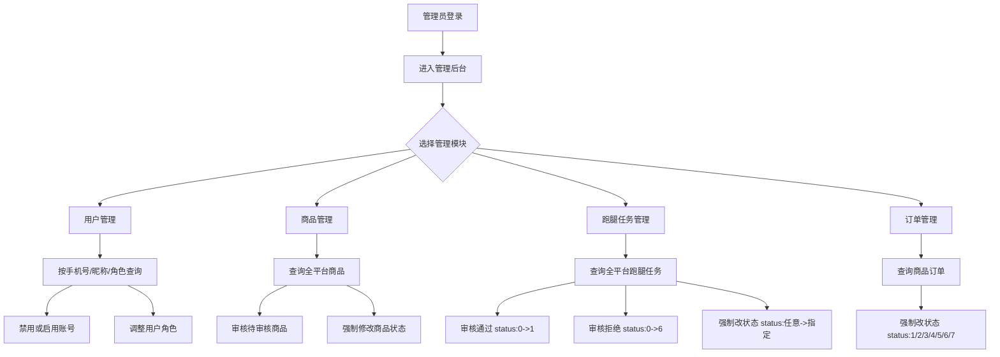
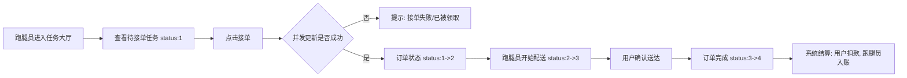
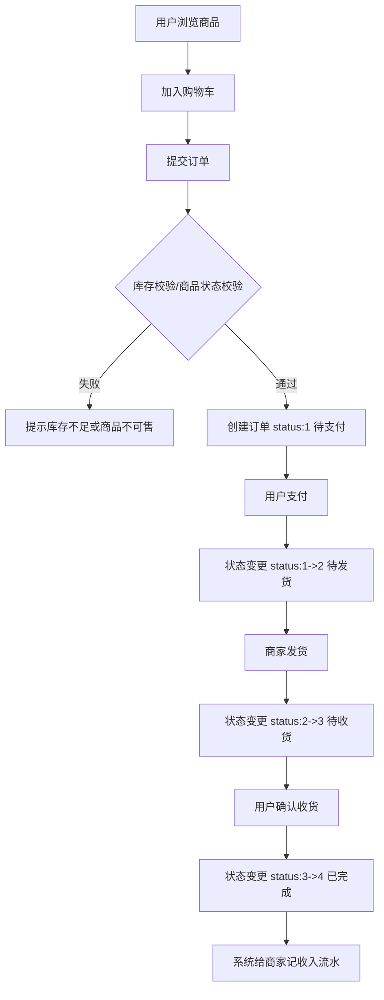
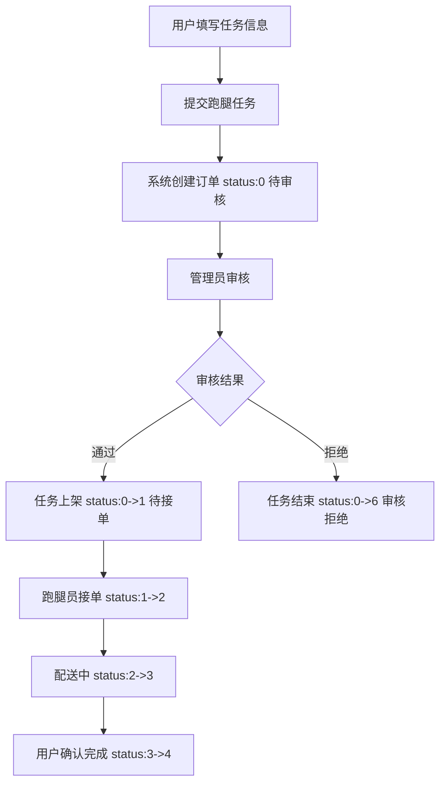

# 校园跑腿与交易系统 - 指定流程图 (Mermaid)

本文件按您的要求，仅保留 4 类流程图：
1. 管理员模块设计流程图
2. 跑腿员接单流程图
3. 用户购买商品流程图
4. 用户发布任务流程图

---

## 1. 管理员模块设计流程图

---

## 2. 跑腿员接单流程图

---

## 3. 用户购买商品流程图

---

## 4. 用户发布任务流程图

---

## 5. 状态码速查

### 商品订单状态
- `1`: 待支付
- `2`: 待发货
- `3`: 待收货
- `4`: 已完成
- `5`: 已取消
- `6`: 退款中
- `7`: 已退款

### 跑腿订单状态
- `0`: 待审核
- `1`: 待接单
- `2`: 已接单
- `3`: 配送中
- `4`: 已完成
- `5`: 已取消
- `6`: 审核拒绝
- `7`: 退款中
- `8`: 已退款
